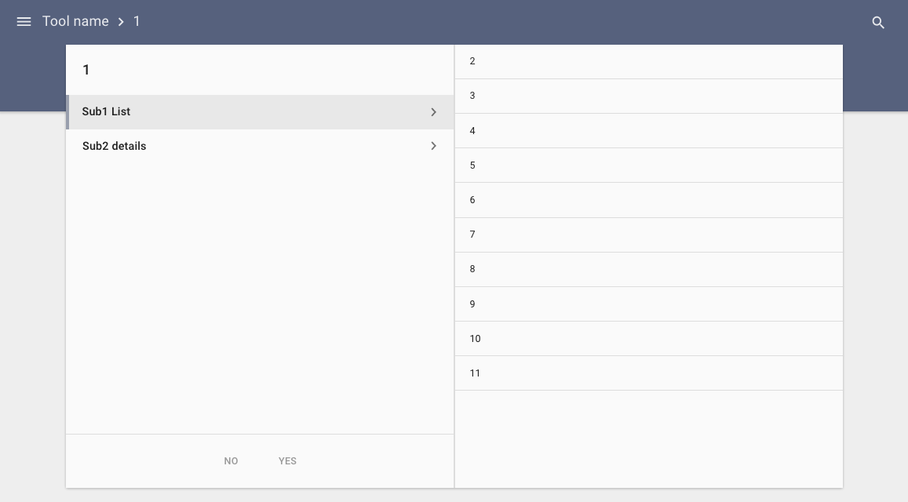

# Pip.WebUI.Split User's Guide

## <a name="contents"></a> Contents
- [Installing](#install)
- [pipSplit service](#split_service)
- [Questions and bugs](#issues)


## <a name="install"></a> Installing

Add dependency to **pip-webui-layouts** and **pip-webui-lib** into your **bower.json** or **package.json** file depending what you use.
```javascript
"dependencies": {
  ...
  "pip-webui-lib": "*"
  "pip-webui-layouts": "*"
  ...
}
```

Alternatively you can install **pip-webui-layouts** and **pip-webui-lib** manually using **bower**:
```bash
bower install pip-webui-lib
bower install pip-webui-layouts
```

or install it using **npm**:
```bash
npm install pip-webui-lib
npm install pip-webui-layouts
```

Include **pip-webui-layouts** and **pip-webui-lib** files into your web application.
```html
<link rel="stylesheet" href=".../pip-webui-lib.min.css"/>
<link rel="stylesheet" href=".../pip-webui.layouts.min.css"/>
...
<script src=".../pip-webui-lib.min.js"></script>
<script src=".../pip-webui.layouts.min.js"></script>
```

Register **pipSplit** module in angular module dependencies.
```javascript
angular.module('myApp',[..., 'pipSplit']);
```

## <a name="split_service"></a> pipSplit service

**pipSplitService** helps to create split layout. That layout can be helpful to organize complex hierarchical content. As user drills down the content, it slides to the right. Going to the top of the hierarchy slides the content to the left. To simplify navigation this content integrates with breadcrumb in **Appbar**

### Usage
```html
<pip-document class="pip-split pip-no-border"
              md-swipe-right="onSwipeRight()" md-swipe-left="onSwipeLeft()">

    <div class="pip-menu-container pip-border-no-top">
        ...
    </div>
</pip-document>
```



See online sample [here...](http://webui.pipdevs.com/pip-webui-split/split/index.html)

### Methods
* **addTransitionSequence** - creates order of states to animate pages in right direction
* **forwardTransition** - returns the direction of animation

## <a name="issues"></a> Questions and bugs

If you have any questions regarding the module, you can ask them using our 
[discussion forum](https://groups.google.com/forum/#!forum/pip-webui).

Bugs related to this module can be reported using [github issues](https://github.com/pip-webui/pip-webui-split/issues).
